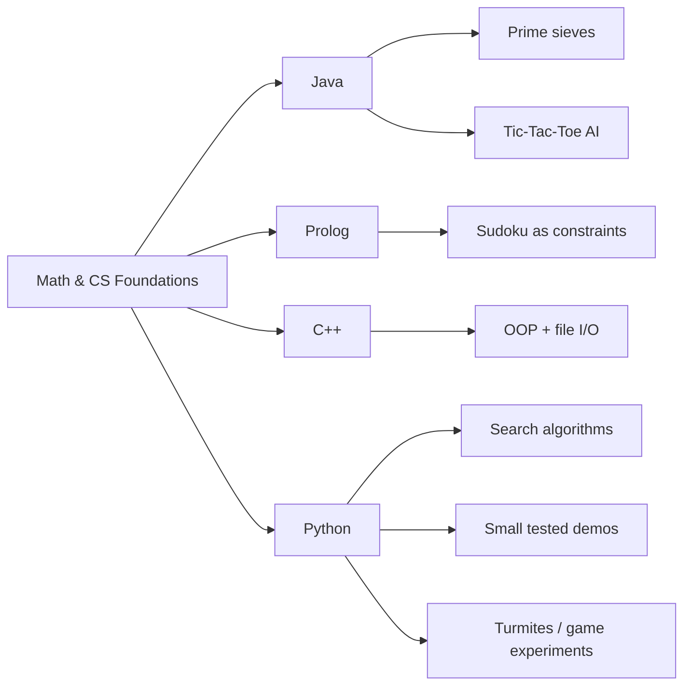

# Math & CS Foundations

Multi-language snapshot of my older computer-science foundations work.

Not a library. Not a contribution project. Just a cleaned portfolio view of the basics underneath the AI/agent stuff: algorithms, game AI, constraint solving, typed modeling and small experiments across different programming languages.



## Simple version

These are the foundations:

- **Java:** prime generators, concurrent checking, Tic-Tac-Toe logic and AI
- **Prolog:** Sudoku solved as a constraint problem
- **C++:** object-oriented inventory/file-I/O exercise
- **Python:** search algorithms, small demos, tests and experiment cleanup

The point is not that everything is huge. The point is that the basics are visible in more than one language and more than one programming style.

## What to look at first

- `showcase/java/` — readable Java files from the prime and Tic-Tac-Toe projects
- `showcase/prolog/sudoku_solver.pl` — CLP(FD) Sudoku solver
- `showcase/cpp/` — selected C++ OOP/file-I/O files
- `src/foundations/` — Python demo layer for quickly checking some of the concepts
- `original_projects/` — fuller old source projects, kept close to how they were

## Project map

<details>
<summary>Open details</summary>

### Prime generation

- **Language:** Java + Python
- **Concepts:** trial division, Sieve of Eratosthenes, Sieve of Atkin, deterministic Miller-Rabin
- **Where:** `showcase/java/SieveOfEratosthenes.java`, `showcase/java/SieveOfAtkin.java`, `src/foundations/primes.py`

### Search algorithms

- **Language:** Python
- **Concepts:** linear search, sentinel search, binary search, exponential search, interpolation search, BFS, DFS, Dijkstra, A*
- **Where:** `src/foundations/sequence_search.py`, `src/foundations/search.py`

### Sudoku / constraint solving

- **Language:** Prolog + Python
- **Concepts:** CLP(FD), constraint solving, backtracking, minimum-remaining-values heuristic
- **Where:** `showcase/prolog/sudoku_solver.pl`, `src/foundations/sudoku.py`

### Game AI

- **Language:** Java + Python
- **Concepts:** board state, minimax, alpha-beta pruning, simple adversarial game logic
- **Where:** `showcase/java/Board.java`, `showcase/java/SmartComputer.java`, `src/foundations/tictactoe.py`, `original_projects/VierGewinntKI`

### C++ fundamentals

- **Language:** C++
- **Concepts:** typed object modeling, inheritance-style structure, file parsing, export logic
- **Where:** `showcase/cpp/`, `original_projects/cpp_oop_inventory`

### Cellular automata

- **Language:** Python
- **Concepts:** Langton's Ant / turmite simulation, state machines, grid updates
- **Where:** `src/foundations/turmites.py`, `original_projects/Turmites`

</details>

## Repo structure

```text
showcase/           selected readable files in Java, Prolog and C++
original_projects/  fuller old projects, preserved as source material
src/foundations/    small Python demo layer
docs/               source and language maps
```

## If you want to run something

This repo is mostly meant to be read, but the Python layer has tests:

```bash
python -m pip install -e '.[dev]'
pytest
```

## Note

This is a personal portfolio showcase. It is shared for reading and evaluation, not maintained as a reusable open-source library.
