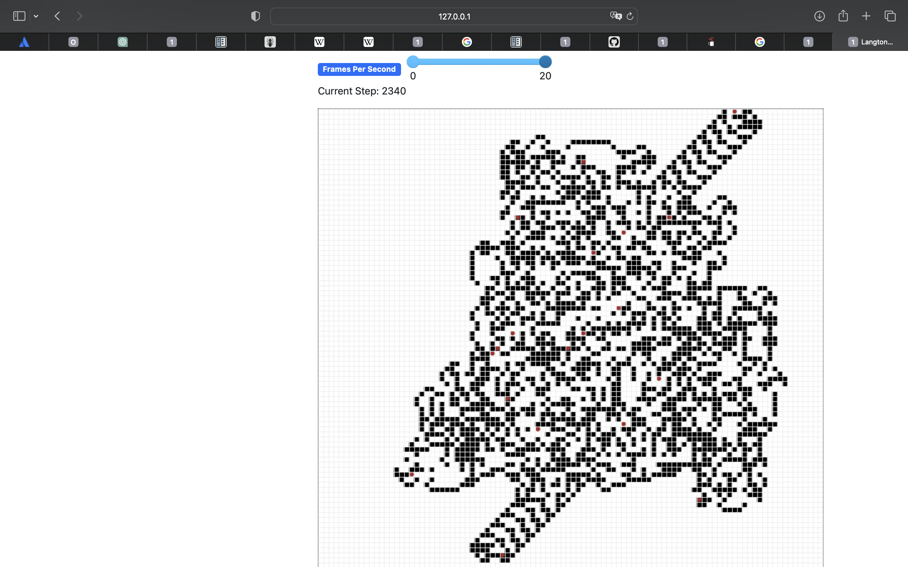
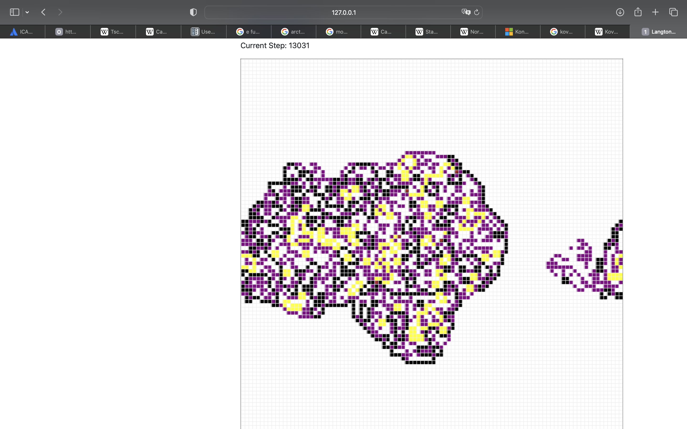
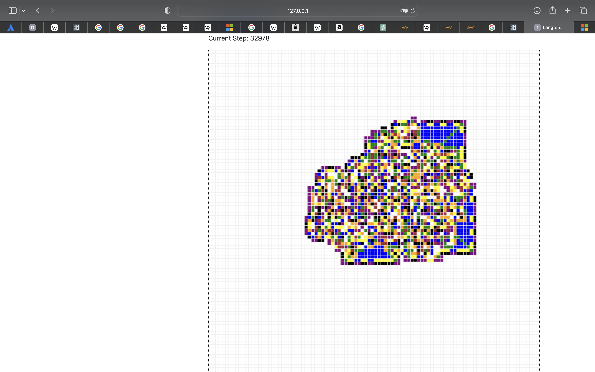
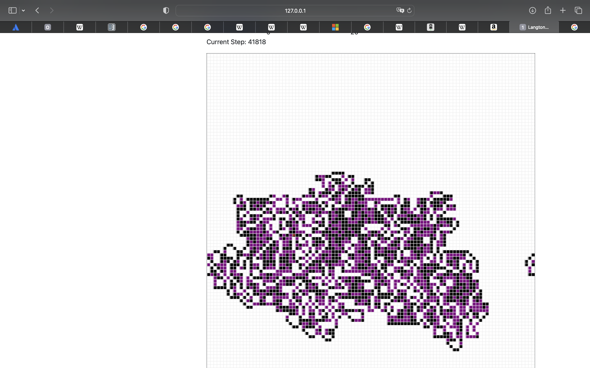

# Math & CS Foundations

A portfolio snapshot of older CS foundations projects — not a library, not a contribution repo.

This is the low-level stuff behind the AI/agent work: algorithms, game AI, constraint solving, object-oriented modeling and small simulations across multiple languages.

<p align="center">
  
  
  
</p>

## Simple version

- **Java:** prime sieves, concurrent prime checking, Tic-Tac-Toe logic and AI
- **Prolog:** Sudoku as a constraint-solving problem
- **C++:** object-oriented modeling, inheritance-style structure and file I/O
- **Python:** search algorithms, Connect Four experiments and cellular automata / turmites

The point is not to make the repo look bigger than it is. The point is to show that the foundations are there, in the languages they were actually built in.

## Project cards

### Java — prime generation

**What it shows:** algorithmic thinking, performance-oriented sieves and concurrent checking.

```text
PrimeGenerator
├── SieveOfEratosthenes.java
├── SieveOfAtkin.java
└── ConcurrentPrimeChecker.java
```

<details>
<summary>Details</summary>

- Sieve of Eratosthenes
- Sieve of Atkin
- concurrent prime checking structure
- original Maven project preserved in `original_projects/PrimeGenerator`
- readable showcase files in `showcase/java/`

</details>

### Java — Tic-Tac-Toe AI

**What it shows:** board modeling, game state, simple AI behavior and testable OOP structure.

```text
TicTacToeAI
├── Board.java
├── Player.java
├── Computer.java
└── SmartComputer.java
```

<details>
<summary>Details</summary>

- object-oriented board representation
- player/computer abstractions
- smarter move logic in `SmartComputer`
- original Maven project preserved in `original_projects/TicTacToeAI`
- readable showcase files in `showcase/java/`

</details>

### Prolog — Sudoku solver

**What it shows:** constraint logic programming instead of brute-force imperative code.

```text
SudokuSolverProlog
└── sudoku_solver.pl
```

<details>
<summary>Details</summary>

- CLP(FD)-based Sudoku solving
- 4x4, 6x6 and 9x9 variants
- this stays Prolog because the language choice is the point
- source: `showcase/prolog/sudoku_solver.pl`

</details>

### C++ — OOP / file I/O inventory exercise

**What it shows:** typed modeling, class boundaries and file parsing/export logic.

```text
cpp_oop_inventory
├── product / dvd / bluray
├── customer
├── warehouse
└── dataio
```

<details>
<summary>Details</summary>

- classes split across headers and implementation files
- product/customer/warehouse domain modeling
- file loading/export logic
- original project preserved in `original_projects/cpp_oop_inventory`
- readable files surfaced in `showcase/cpp/`

</details>

### Python — search algorithms

**What it shows:** classic algorithm implementations in small readable scripts.

```text
Suchalgorithmen/Sequenzen
├── linear_search.py
├── linear_sentinel_search.py
├── binary_search.py
├── exponential_search.py
└── interpolation_search.py
```

<details>
<summary>Details</summary>

These are kept as original Python scripts instead of being wrapped into a fake package.

Source: `original_projects/Suchalgorithmen/Sequenzen/`

</details>

### Python — Connect Four AI experiments

**What it shows:** adversarial-game experiments and heuristic AI attempts.

```text
VierGewinntKI
├── ai1.py
├── ai2.py
├── helper.py
└── vier_gewinnt.py
```

<details>
<summary>Details</summary>

Not polished into a product. Preserved as source material because it shows the direction: game logic, move selection and AI experimentation.

Source: `original_projects/VierGewinntKI/`

</details>

### Python — Langton's Ant / Turmites

**What it shows:** grid simulations, state machines and visual emergent behavior.

<p align="center">
  
  
</p>

<details>
<summary>Details</summary>

- Langton's Ant
- multi-color turmite variants
- multiple-ant experiments
- original scripts and images preserved in `original_projects/Turmites/`

This is one of the more visual foundation projects, so the generated outputs are part of the showcase instead of being hidden as random old PNGs.

</details>

## Repo structure

```text
showcase/           selected readable files and visual assets
original_projects/  older projects preserved close to source
NOTICE.md           portfolio/context note
```

## Note

This repository is shared for reading and evaluation. It is not maintained as a reusable package or open-source project.
